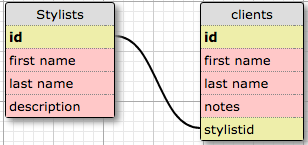

# Hair Salon

#### _A Web Application for Epicodus Java Week 3 Independent Project, 09.23.2016_

#### By **Sheena Nickerson**

## Description

This is a web application for a hair salon where the user can add a list of stylists, and for each stylist, add clients who see that stylist. The stylists work independently, so each client only belongs to a single stylist.

## Database Schema

## Technical Specifications

| Behavior                                 | Example Input                                                                                                                                                 | Example Output                                                                                                                                                |
|------------------------------------------|---------------------------------------------------------------------------------------------------------------------------------------------------------------|---------------------------------------------------------------------------------------------------------------------------------------------------------------|
| Store stylist first name                 | 'John'                                                                                                                                                        | 'John'                                                                                                                                                        |
| Store stylist last name                  | 'Doe'                                                                                                                                                         | 'Doe'                                                                                                                                                         |
| Store stylist description                | 'John specializes in hair color and balayage highlights.'                          | 'John specializes in hair color and balayage highlights.'                          |
| Return all stylists                      | All stylists                                                                                                                                                  | {'John', 'Taylor', 'Stephanie'}                                                                                                                               |
| Store client first name                  | 'Jane'                                                                                                                                                        | 'Jane'                                                                                                                                                        |
| Store client last name                   | 'Smith'                                                                                                                                                       | 'Smith'                                                                                                                                                       |
| Store notes about client                 | 'Has visited two times. Used color Como Light Brown 7NGM.'                                                                                                    | 'Has visited two times. Used color Como Light Brown 7NGM.'                                                                                                    |
| Store client's stylist id                | 1                                                                                                                                                             | 1                                                                                                                                                             |
| Return all clients                       | All clients                                                                                                                                                   | {'Jane', 'Jessica', 'Dan'}                                                                                                                                    |
| Return all clients of a specific stylist | Stylist 'John'                                                                                                                                                | Client 'Jane'                                                                                                                                                 |
| Update stylist information               | 'John specializes in hair color and balayage highlights, and also men's haircuts.' | 'John specializes in hair color and balayage highlights, and also men's haircuts.' |
| Update client information                | 'Has visited three times. Blonde highlights with Bologna Blonde 8NYA.'                                                                                        | 'Has visited three times. Blonde highlights with Bologna Blonde 8NYA.'                                                                                        |
| Delete a stylist                         | 'John'                                                                                                                                                        | null                                                                                                                                                          |
| Delete a client                          | 'Jane'                                                                                                                                                        | null                                                                                                                                                          |

## Setup / Installation Requirements

You will need [gradle](https://gradle.org/gradle-download/) and Postgres installed on your device.

Enter the following commands in your terminal:
* `git clone https://github.com/sheenanick/java-hair-salon` to clone this repository
* `postgres` to start the Postgres server
* `gradle run` to run the application

View http://localhost:4567 in a web browser of your choice.

In PSQL:
* `CREATE DATABASE hair_salon;`
* `CREATE TABLE stylists (id serial PRIMARY KEY, firstname varchar, lastname varchar, description varchar);`
* `CREATE TABLE clients (id serial PRIMARY KEY, firstname varchar, lastname varchar, notes varchar, stylistid integer);`

## Support and contact details

Please feel free to contact sheenanick@gmail.com if you have any issues or questions, ideas or concerns.

## Technologies Used

* Java
* JUnit
* Spark
* Gradle
* PostgreSQL

### License

Licensed under the MIT license.

Copyright (c) 2016 **_Sheena Nickerson_**
